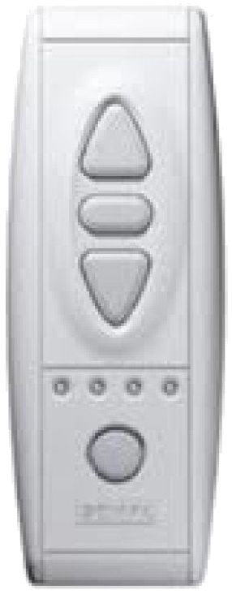
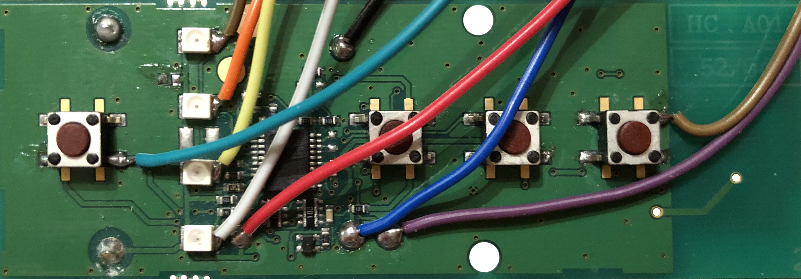
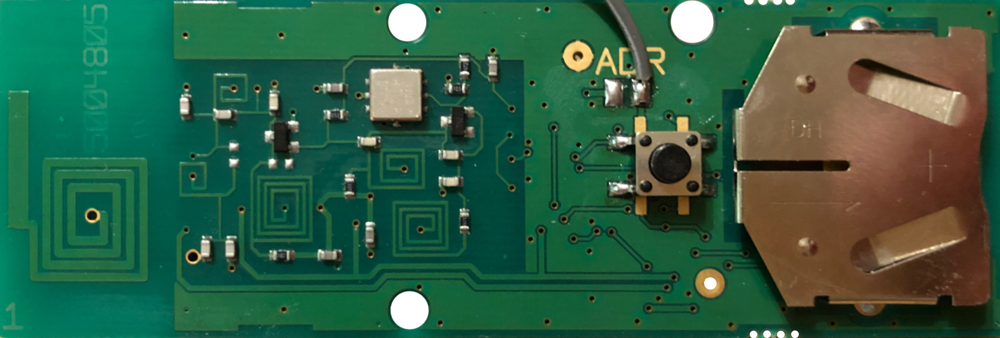

# Somfy Telis 4 Remote API for ESP8266

## API

### `command`

- `up`:&nbsp;&nbsp;&nbsp;&nbsp;&nbsp;&nbsp;&nbsp;&nbsp;&nbsp;△
- `stop`:&nbsp;&nbsp;&nbsp;&nbsp;&nbsp;⬜︎
- `down`:&nbsp;&nbsp;&nbsp;&nbsp;&nbsp;▽
- `switch`:&nbsp;○

### `channel`

- `0`: ⬛︎ ⬛︎ ⬛︎ ⬛︎
- `1`: ⬛︎ ⬜︎ ⬜︎ ⬜︎
- `2`: ⬜︎ ⬛︎ ⬜︎ ⬜︎
- `3`: ⬜︎ ⬜︎ ⬛︎ ⬜︎
- `4`: ⬜︎ ⬜︎ ⬜︎ ⬛︎

### Usage

Press “up” button for channel 1.

```http
POST /
```

```json
{"channel": 1, "command": "up"}
```


Press “stop” button for channel 4.

```http
POST /
```

```json
{"channel": 4, "command": "stop"}
```

Press “down” button for channel 0.

```http
POST /
```

```json
{"channel": 0, "command": "down"}
```

Switch to channel 3.

```http
POST /
```

```json
{"channel": 3, "command": "switch"}
```


## Hardware

Needed items:

- 1 × Somfy Telis 4  
  
  

- 1 × ESP8266 (NodeMCU)
- 4 × PC817 Optocoupler
- 1 x 200 Ohm Resistor





### Pins

| Name  | Description                             |
|-------|-----------------------------------------|
| L1    | brown cable to LED                      |
| L2    | orange cable to LED                     |
| L3    | yellow cable to LED                     |
| L4    | white cable to LED                      |
| B1    | green cable to button                   |
| B2    | blue cable                              |
| B3    | purple cable                            |
| GB    | brown cable to button                   |
| GS    | gray cable on backside                  |
| D1-D7 | respective pin on ESP8266 (NodeMCU)     |
| A1-A4 | anode on the respective optocoupler     |
| K1-K4 | cathode on the respective optocoupler   |
| E1-E4 | emitter on the respective optocoupler   |
| C1-C4 | collector on the respective optocoupler |

### Connections

| Name                            | Description                        |
|---------------------------------|------------------------------------|
| GPIO for LED 1                  | `L1` → `D1`                        |
| GPIO for LED 2                  | `L2` → `D2`                        |
| GPIO for LED 3                  | `L3` → `D5`                        |
| GPIO for LED 4                  | `L4` → `D6`                        |
| Input Voltage for Up Button     | `B1` → `C1`                        |
| Input Voltage for Stop Button   | `B2` → `C2`                        |
| Input Voltage for Down Button   | `B3` → `C3`                        |
| Ground for Up/Stop/Down Buttons | `E1-E3` → `GB`                     |
| Input Voltage for Switch Button | `B1` → `C4`                        |
| Ground for Switch Button        | `E4` → `GS`                        |
| Input Voltage for Optocouplers  | 3.3V → 200 Ohm Resistor → `A1-A4`  |
| GPIO for Up Button              | `K1` → `D4`                        |
| GPIO for Stop Button            | `K2` → `D0`                        |
| GPIO for Down Button            | `K3` → `D3`                        |
| GPIO for Switch Button          | `K4` → `D7`                        |
